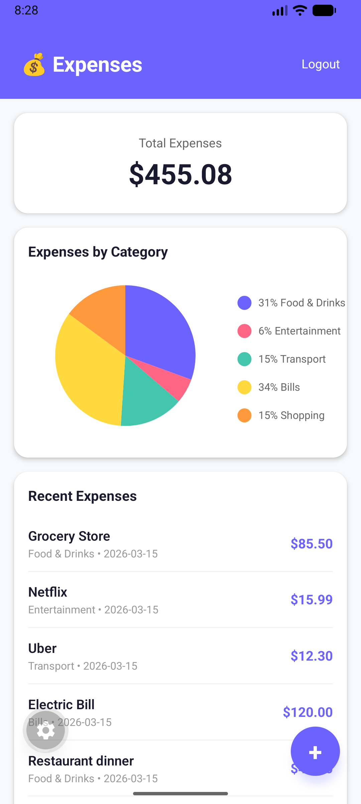
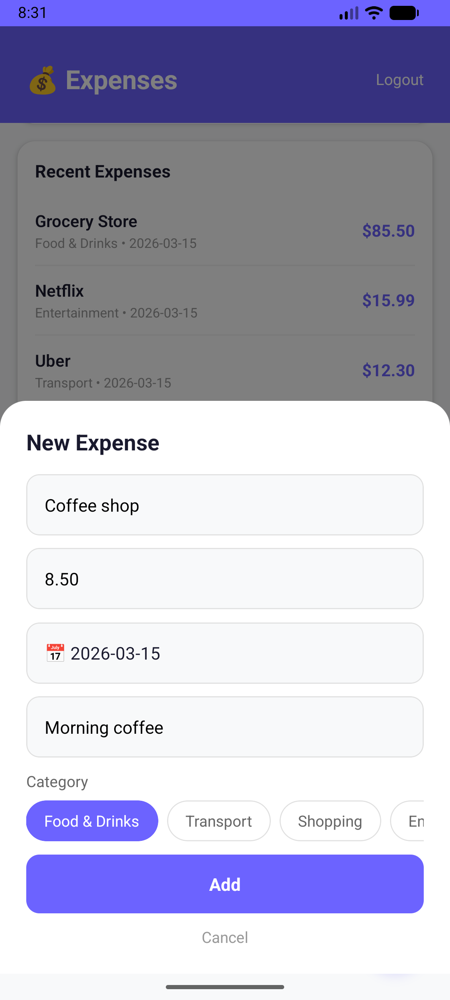
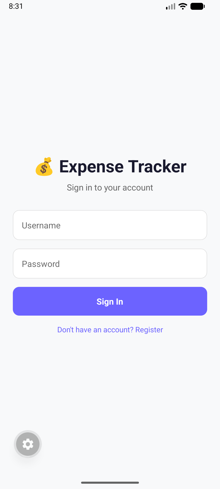

# Expense Tracker Mobile App

A cross-platform iOS & Android expense tracking app built with React Native and Expo.

## 📸 Screenshots




## 🛠️ Tech Stack
- React Native
- Expo (SDK 55)
- TypeScript
- Axios (API communication)
- React Navigation
- react-native-chart-kit (pie chart)
- expo-secure-store (secure token storage)

## ✨ Features
- JWT Authentication (login & register)
- Add, view, and delete expenses
- Category selection with chips
- Pie chart visualization by category
- Date picker
- Token refresh — automatic re-authentication
- Works on both iOS & Android

## 🔗 Related Repositories
- [Backend API](https://github.com/plamenzubev/expense-tracker-api)
- [Web Dashboard](https://github.com/plamenzubev/expense-tracker-web)

## ⚙️ Getting Started
```bash
git clone https://github.com/plamenzubev/expense-tracker-mobile.git
cd expense-tracker-mobile
npm install
npx expo start
```

## 🌐 API
This app connects to the [Expense Tracker API](https://expense-tracker-api-w29w.onrender.com/api/).